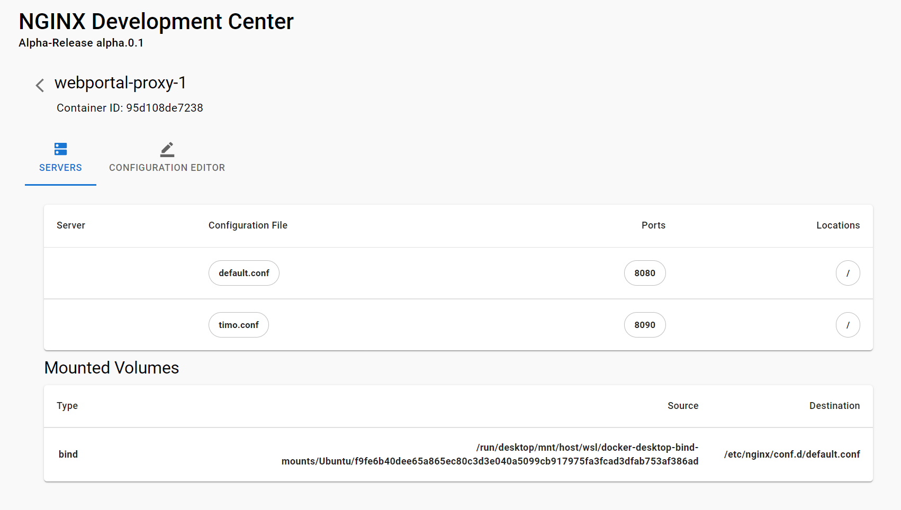

# NGINX Docker Desktop Extension



The NGINX Docker Desktop Extension can be used to manage the instance configuration of a running NGINX container.

## Development
Before we can interactively develop the Extensions frontend, it must be installed first.

To build the extension locally -
```shell
docker build -t nginx/nginx-dd-extension .
```
To install the extension -
```shell
docker extension install nginx/nginx-dd-extension
```

To remove the extension -
```shell
docker remove nginx/nginx-dd-extension
```
## Release

Use the provided Makefile to cross-compile and push an image that supports amd64 and arm64 architectures -

```
IMAGE=dockerhubid/nginx-dd-extension TAG=latest make push-extension
```

### Start Docker Extension Development Server
1. start the UI node server in the `ui` directory. Make sure you install the dev dependencies first -

```shell
npm install
npm run dev
```

2. enable debugging for the NGINX Docker Extension -

```shell
docker extension dev debug nginx/nginx-dd-extension 
```

```shell
docker extension dev ui-source nginx/nginx-dd-extension http://localhost:3000 
```
## Community

- The go-to place to start asking questions and share your thoughts is
  our [Slack channel](https://community.nginx.org/joinslack).

- Get involved with the project by contributing! See the
  [contributing guide](CONTRIBUTING.md) for details.

- For security issues, [email us](security-alert@nginx.org), mentioning
  NGINX Unit in the subject and following the [CVSS
  v3.1](https://www.first.org/cvss/v3.1/specification-document) spec.


## Backlog

### Re-Expose new Ports
```shell
docker commit CONTAINERID NEWIMAGE
docker run NEWIMAGE -p ... -p.... -v POSSIBLE MOUNTS
```
### Export Configuration
Export configuration files from inside the container to a projects directory on the local computer
```shell
docker cp CONTAINERID:/etc/nginx/conf.d/test.conf ./something/....
```
